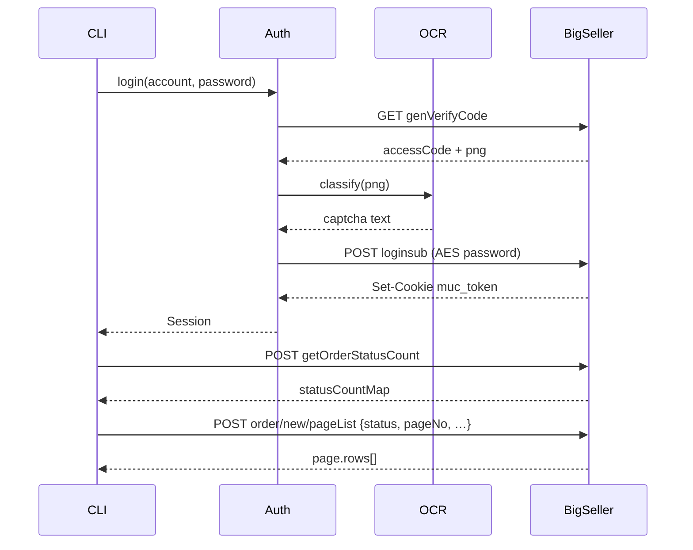

# BigSeller API map (Playwright + live probe)

Captured **2026-07-21** against `https://www.bigseller.com` with a fresh login session  
(`muc_token` + `JSESSIONID`, header `clienttype: 1`).

Sources:

- Playwright network log on `/web/order/index.htm` (+ status query variants)
- Live HTTP probe with session cookies
- Login flow already proven in this crate (OCR + AES)
- Full `pageList` request template from browser reverse (`pageList-request-template.json`)

Artifacts in this folder:

| File | Content |
|------|---------|
| `api-catalog.txt` | 52 unique method+path pairs observed |
| `api-samples.json` | Response shape summaries (`code`, `dataKeys`, …) |
| `order-row-keys.json` | 214 fields on a single order row |
| `pageList-request-template.json` | Full UI filter body (browser) |

---

## 1. Transport conventions

| Concern | Rule |
|---------|------|
| Base | `https://www.bigseller.com` |
| Auth cookie | `muc_token` (JWT), often + `JSESSIONID` |
| Required header | `clienttype: 1` |
| JSON envelope | `{ "code": 0, "errorType": 0, "msg": "Successfully", "msgObjStr": "", "data": … }` |
| Success | `code === 0` |
| Auth failure | `code` like `2001` / msg containing `401` — re-login |
| Content-Type | `application/json` for POST bodies |
| Referer | page context, e.g. `/web/order/index.htm` or `/en_US/login.htm` |

Two URL prefixes:

| Prefix | Used for |
|--------|----------|
| `/api/v1/…`, `/api/v3/…` | App APIs after login |
| `/api_v2/api/v2/…`, `/api_v2/api/v3/…` | Auth / captcha (login stack) |

---

## 2. Auth / session

| Method | Path | Role |
|--------|------|------|
| `GET` | `/api_v2/api/v2/genVerifyCode.json` | Captcha: `data.accessCode`, `data.base64Image` |
| `POST` | `/api_v2/api/v3/auth/loginsub.json` | Login body: `account`, AES `password`, `accessCode`, `picVerificationCode`, `fingerPrint`, **`authType: "email"`**, `phoneAccountCode: ""`, `bsMetrics: null` |
| `GET` | `/api/v1/isLogin.json` | `data: true/false` — session health check |

Password blob (frontend CryptoJS):  
`"0" + hex(rnd2) + hex(iv16) + hex(key16) + hex(AES-CBC-PKCS7(utf8 password))`.

---

## 3. Order domain (core product surface)

### 3.1 List + counts (primary)

| Method | Path | Notes |
|--------|------|-------|
| `POST` | `/api/v1/order/new/pageList.json` | **Single list endpoint** for buckets; filter via body `status` (not path segments). Path name is historical (`new/`). |
| `POST` | `/api/v1/order/getOrderStatusCount.json` | Sidebar counts + shop/platform maps |

**`pageList` body (minimal that works):**

```json
{
  "status": "new",
  "pageNo": 1,
  "pageSize": 50,
  "orderBy": "expireTime",
  "desc": 0,
  "inquireType": 2,
  "timeType": 1,
  "searchType": "orderNo",
  "packState": "0",
  "allOrder": false,
  "historyOrder": false,
  "virtualProductFilterType": 0,
  "showLogisticsArr": 0,
  "showStoreArr": 0
}
```

UI sends ~90 optional filters (`null` / `""` / `[]`). Full template: `pageList-request-template.json`.

**Proven `status` values (live):**

| `status` | pageList works | Example total (this account) |
|----------|----------------|------------------------------|
| `new` | yes | 48 |
| `canceled` | yes | 508 |
| `shipped` | yes* | 0 at probe time (count map had 403 — filters differ) |
| `completed` | often fails with bare body (`code: -1`) — needs full UI filters / `historyOrder` |
| `packing`, `cancel`, `return`, `unpaid` | **invalid** as bare status strings |
| `Return refund`, `platformProcessing`, `toBeSupplemented` | accepted; totals depend on filters |

**`getOrderStatusCount` → `data.statusCountMap` keys observed:**

```text
new, shipped, completed, canceled, cancelSumCount,
platformProcessing, "Return refund", toBeSupplemented, deadlineCount
```

Also returns: `countMap`, `shopLists`, `platformList`, `shipProviderList`, `warehouseMap`, `labelList`, …

**`pageList` → `data`:**

```text
page { pageNo, pageToken, pageSize, totalPage, totalSize, rows[] }
state, userTag, warehouseUsedState, itemShowNum, stateMap, …
```

**Row model:** ~214 fields (`order-row-keys.json`). Important groups:

- Identity: `id`, `platformOrderId`, `packageNo`, `shopId`, `shopName`, `platform`
- Status: `state`, `viewStatus`, `marketPlaceState`, `packState`, `payStatus`
- Money: `amount`, `amountUnit`, `paymentMethod`
- Logistics: `trackingNo`, `shipmentProvider`, `shippingCarrierName`, `buyerShippingCarrier`
- Buyer: `buyerUsername`, `contactPerson`, `recipient`
- Nested: `orderItemList[]`, `orderRemarksList[]`, `labelList[]`, `feeDetail{}`

`orderItemList[]` sample keys: `skuId`, `itemName`, `varSku`, `quantity`, `amount`, `image`, `inventorySku`, …

### 3.2 Order page support APIs (loaded with the UI)

| Method | Path | Role |
|--------|------|------|
| `GET` | `/api/v1/order/refreshSyncCheck.json` | Sync freshness (int) |
| `GET` | `/api/v1/order/getNewOrderMessageRemind.json` | New-order toast |
| `GET` | `/api/v1/order/v2/filterList.json` | Saved filters flag |
| `GET` | `/api/v1/order/tiktok/getFailReason.json` | TikTok fail reasons |
| `GET` | `/api/v1/order/constant/queryLogisticsServices.json` | Logistics service constants |
| `GET` | `/api/v1/order/searchConfig/getSearchConfigsAndUncheckedIds.json` | Search bar config |
| `POST` | `/api/v1/order/enableOrderNumSort.json` | Sort preference |
| `POST` | `/api/v1/order/wave/getWaveSippedUsedState.json` | Wave shipping feature flag |
| `POST` | `/api/v1/queryCondition/getOrderSearchTag.json` | Search tags (needs body; bare `{}` → code -1) |
| `POST` | `/api/v1/orderSettings/other/index.json` | Order automation settings |
| `GET` | `/api/v1/orderSettings/template/queryPickTemplateList.json` | Pick list templates |
| `GET` | `/api/v1/setting/config/getUserChooseConfigs.json` | Column/layout prefs |
| `POST` | `/api/v1/show/query/config.json` | UI show config |
| `GET` | `/api/v1/3pl/shipping/list.json` | 3PL shipping list |
| `GET` | `/api/v1/inventorySetting/list.json` | Inventory feature flags |
| `GET` | `/api/v1/shop/group/page.json` | Shop groups |
| `POST` | `/api/v1/warehouse/getThirdWareCount.json` | 3rd-party warehouse count |

There is **no** `/api/v1/order/{status}/pageList.json` — path variants 404.

---

## 4. Session bootstrap (every authenticated page)

Loaded on order/home shell before domain data:

| Method | Path | Role |
|--------|------|------|
| `GET` | `/api/v1/lang/getLang.json` | Locale |
| `GET` | `/api/v1/isLogin.json` | Auth gate |
| `GET` | `/api/v1/index.json` | User, VIP, site, feature flags |
| `GET` | `/api/v3/account/userRights.json` | Rights / scopes |
| `GET` | `/api/v1/shopsAndPlatforms.json` | Shops + platforms |
| `GET` | `/api/v1/goods/getPaidGoodsNum.json` | Plan quotas |
| `GET` | `/api/v1/goods/quotaDetection.json` | Quota checks |
| `GET` | `/api/v1/distributor/getDistributorRole.json` | Distributor role |
| `GET` | `/api/v1/common/toolkit/checkFeatureAccess.json` | Feature gates |
| `GET` | `/api/v1/common/toolkit/stat/offline.json` | Offline stats flag |
| `GET` | `/api/v1/alert/homeAlertInfo.json` | Alerts |
| `GET` | `/api/v1/newMessages.json` | Inbox badge |
| `GET` | `/api/v1/setting/column/productCustomizeNavigationList.json` | Nav customization |
| `GET` | `/api/v1/getFunctionWhite.json` | Whitelist features |
| `GET` | `/api/v1/getHelpDocumentContentConfig.json` | Help docs |

Home/dashboard extras (also observed):  
`dashboard/orderInventoryCount`, `orderSalesStatistics`, `expiredShops`, `scrollMessages`, `announcement/systemAndPlatform`, …

---

## 5. Priority tiers for the Rust client

### P0 — must implement cleanly (orders product)

1. Auth: captcha + login + session persist + `isLogin`
2. `order/getOrderStatusCount`
3. `order/new/pageList` with typed filters + status enum
4. Envelope parse + auth-error → re-login hook
5. Domain types: `Order`, `OrderItem`, `StatusCounts`, `Shop`

### P1 — useful context

6. `index` (account/VIP)
7. `shopsAndPlatforms`
8. `userRights`
9. Search/filter config endpoints (when building rich CLI/UI)

### P2 — ignore unless needed

- Analytics, Sentry (`code-trace.bigseller.pro`), marketing pixels  
- Help docs, announcements, album summary  
- Wave / pick-template / print pipelines (until packing workflow)

---

## 6. Gaps / follow-ups

- [ ] Capture **mutation** APIs (print label, mark shipped, pack, cancel) via Playwright click flows  
- [ ] Exact body for `completed` / `shipped` when UI filters differ from bare `status`  
- [ ] `getOrderSearchTag` required body schema  
- [ ] Order detail endpoint (single order by id) — not hit on list page load  
- [ ] WebSocket / long-poll if any (not observed on list load)

---

## 7. Mermaid — runtime call graph (order list)


